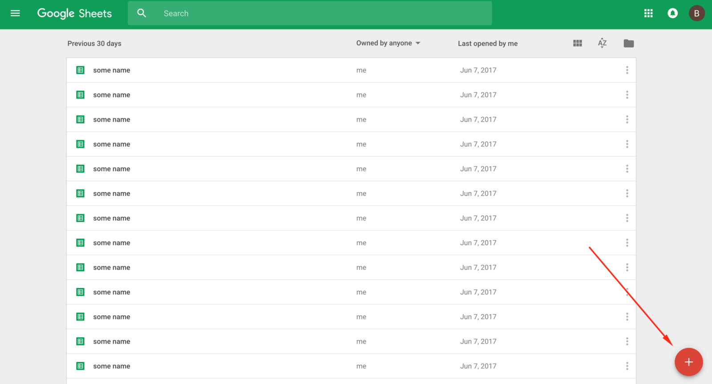
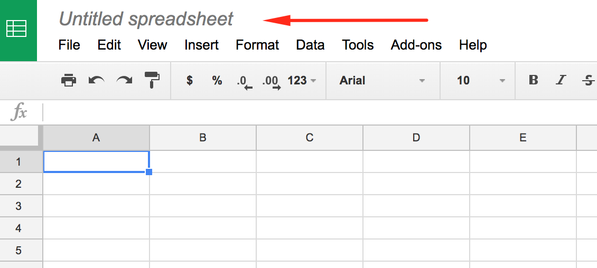
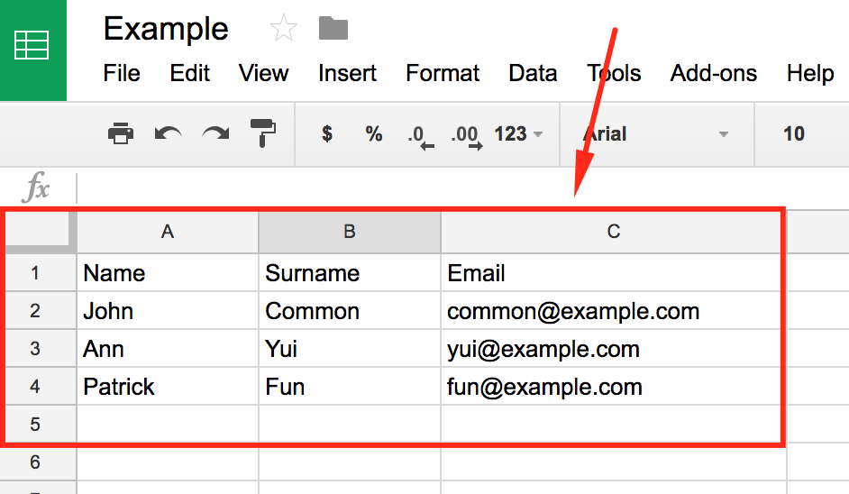
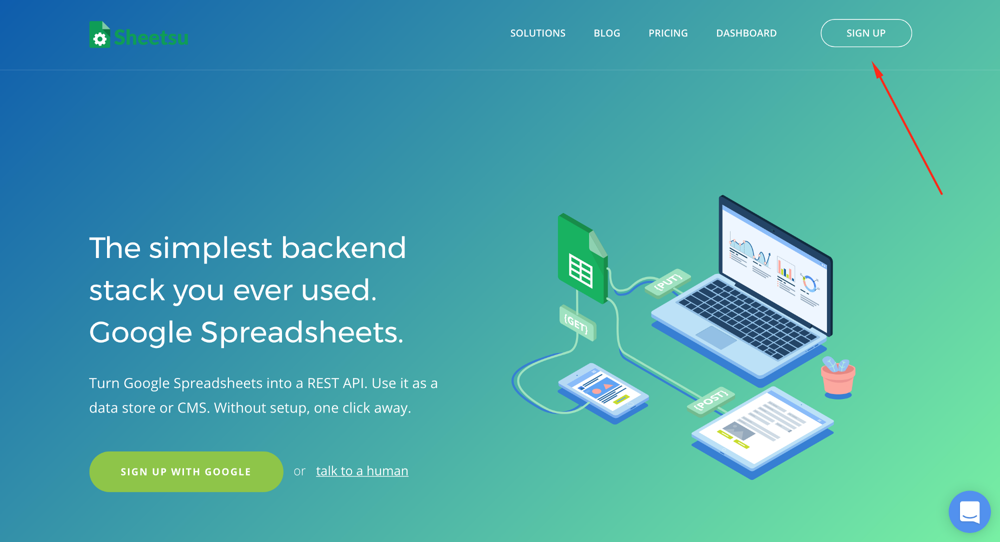
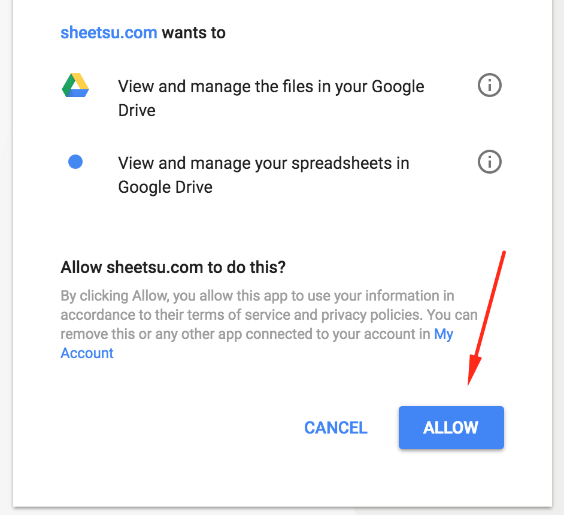
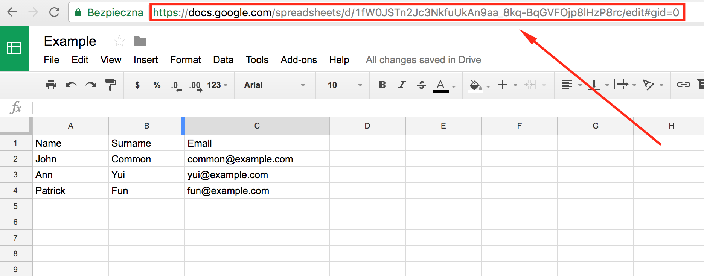
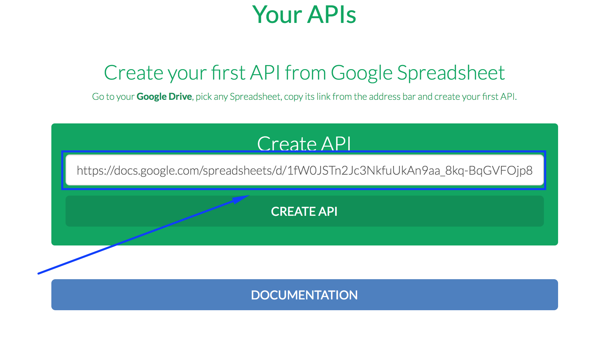

# Sheetsu Web Client

Google Spreadsheets as a website database. Store, edit and analyse data even with no knowledge of SQL.
With few lines of code you can read and write data to Google Spreadsheets.


Quick start
1. [Read data from database](#read-data)
2. [Search](#search)
3. [Read and update HTML elements](#read-and-update-html-elements)
4. [Save data](#save-data)
5. [Plot chart](#plot-chart)

Other
- [Installation](#installation)
- [What is Sheetsu?](#what-is-sheetsu)
- [How to create Google Spreadsheets API?](#how-to-create-google-spreadsheets-api)
- [Docs](#docs)

[Go to Sheetsu website &rarr;](https://sheetsu.com)

All examples shown below run on this [Google Spreadsheet file](https://docs.google.com/spreadsheets/d/1WTwXrh2ZDXmXATZlQIuapdv4ldyhJGZg7LX8GlzPdZw/edit?usp=sharing).

## Read data

Read data from Google Spreadsheets anywhere on the web. It works with ALL website builders, browsers, and front-end technologies.

```html
<head>
  <!-- Add Sheetsu Web Client script to the head -->
  <script src="//script.sheetsu.com/"></script>
</head>

<body>
  <script>
    // In this example data is saved to the window.users variable
    // So it's available for use anywhere in the app/page
    function successFunc(data) {
      window.users = data;
    }

    // Use Sheetsu.read to get data from a spreadsheet.
    // Pass callback function, which takes one argument - data
    // It's triggered after getting data from API
    Sheetsu.read("https://sheetsu.com/apis/v1.0/020b2c0f/", {}, successFunc);
  </script>
</body>
```
[Play with the live version of the code on CodePen](https://codepen.io/sheetsu/pen/EXJOYx)

## Search

Search Google Spreadsheets for a record that matches your criteria.

```html
<head>
  <!-- Add Sheetsu Web Client script to the head -->
  <script src="//script.sheetsu.com/"></script>
</head>

<body>
  <script>
    // Print out data to the console
    function successFunc(data) {
      console.log(data);
    }

    // Use Sheetsu.read to get data from a spreadsheet.
    // Pass search with JSON to perform a get only results matching your criteria
    var searchQuery = { score: 42 };
    // Pass callback function, which takes one argument - data
    // It's triggered after getting data from API
    Sheetsu.read("https://sheetsu.com/apis/v1.0/020b2c0f/", { search: searchQuery }, successFunc);
  </script>
</body>
```
[Play with the live version of the code on CodePen](https://codepen.io/sheetsu/pen/gRyQMv?editors=1111)

## Read and update HTML elements

Get elements from Google Spreadsheets and show them on the web.

```html
<head>
  <!-- Add Sheetsu Web Client script to the head -->
  <script src="//script.sheetsu.com/"></script>
</head>

<body>
  <ul id="list"></ul>

  <script>
    // API returns array of objects
    // Iterate over them and add each element as a list element
    function successFunc(data) {
      data.forEach(function(item, i) {
        document.getElementById("list").innerHTML += "<li>" + item.name + " " + item.score + "</li>";
      });
    }

    Sheetsu.read("https://sheetsu.com/apis/v1.0/020b2c0f/", {}, successFunc);
  </script>
</body>
```
[Play with the live version of the code on CodePen](https://codepen.io/sheetsu/pen/qjwQqa)

## Save data

Save data from the form to the Google Spreadsheets

```html
<head>
  <!-- Add Sheetsu Web Client script to the head -->
  <script src="//script.sheetsu.com/"></script>
</head>
<body>
  <form id="myForm">
    <input type="text" name="first_name">
    <input type="text" name="score">
    <button type="submit">Save</button>
  </form>

  <script>

    document.querySelector("#myForm").addEventListener("submit", function(e) {
      e.preventDefault();
      saveData();
    });

    function saveData() {
      // Get data from inputs
      var first_name = document.getElementsByName("first_name")[0].value,
          score = document.getElementsByName("score")[0].value;

      // Prepare JSON to be send
      var data = { name: first_name, score: score };

      // Save data to a spreadsheet
      // Arguments
      // 1 - API URL
      // 2 - JSON representation of a row you want to save
      // 3 - options
      // 4 - callback function after successful save
      Sheetsu.write("https://sheetsu.com/apis/v1.0/020b2c0f/", data, {}, function(x) {console.log(x);});
    }
  </script>
</body>
```
[Play with the live version of the code on CodePen](https://codepen.io/sheetsu/pen/NgmerW?editors=1111)

## Plot chart

Plot chart with [HighchartJS](https://www.highcharts.com/).

```html
<head>
  <script src="https://code.highcharts.com/highcharts.js"></script>
  <script src="https://code.highcharts.com/modules/data.js"></script>
  <script src="https://code.highcharts.com/modules/drilldown.js"></script>
  <script src="//script.sheetsu.com/"></script>
</head>
<body>
  <div id="container" style="min-width: 310px; height: 400px; margin: 0 auto"></div>

  <script>
    Sheetsu.read("https://sheetsu.com/apis/v1.0/020b2c0f/", {}, successFunc);

    function successFunc(data) {
      Highcharts.chart("container", {
        chart: { type: "column" },
        title: { text: "Family Guy Score" },
        series: [
          {
            colorByPoint: true,
            data: data.map(function(item) {
              return { name: item.name, y: parseInt(item.score, 10) };
            })
          }
        ]
      });
    }
  </script>
</body>

```
[Play with the live version of the code on CodePen](https://codepen.io/sheetsu/pen/RgOdaZ)

# Installation
To install Sheetsu Web Client, just add
```
<script src="//script.sheetsu.com/"></script>
```
to the `<head>` of a website.
Or anywhere else. It should work anyway :)

# What is Sheetsu

[Sheetsu](https://sheetsu.com) is a connection between you and Google Spreadsheets, you can use **anywhere** on the web. You don't need to worry about authorization, refreshing tokens. You just speak with Google Spreadsheets, the easy language you know.

[Go to Sheetsu website &rarr;](https://sheetsu.com)

# How to create Google Spreadsheets API?
### 1. Create a new Google Spreadsheets file
Open your browser and go to the [Google Spreadsheets site](https://docs.google.com/spreadsheets/u/0/). Create a new spreadsheet by clicking the "+" button. We will read data from this spreadsheet.



Name your new spreadsheet.



I named it "Example". Then add an example data. [You can copy them from this doc](https://docs.google.com/spreadsheets/d/1fW0JSTn2Jc3NkfuUkAn9aa_8kq-BqGVFOjp8lHzP8rc/edit#gid=0). Remember about naming columns first.



### 2. Go to Sheetsu.com and sign up
When spreadsheet part is done, you need to [Sign up to Sheetsu](https://sheetsu.com). [Let's go to Sheetsu main page](https://sheetsu.com) and click "SIGN UP" button in top-right corner of the website.



Sheetsu is using Google Authorization system, so you will be redirected to Google accounts page to give some permissions.



If you accept them, click ALLOW button.
And puff! It is done! We are on the dashboard.

### 3. Copy API URL from Sheetsu
To create an API you need to go back to your previously created spreadsheet and copy its URL.



And the last thing to do is to paste this URL in your dashboard and click "CREATE API" button.



After that, your Sheetsu API will be created. You can click on a generatated link and see the results:


## Docs

[Sheetsu documentation sits on GitHub](https://github.com/sheetsu/docs). We would love your contributions! We want to make these docs accessible and easy to understand for everyone. Please send us Pull Requests or open issues on GitHub.

### Sheetsu.read(url, options, callback)
Read data from Google Spreadsheet. Runs `callback` on success. `options` can be:
```
limit - number of how many rows should be returned
offset - number from which row response should start (default is 0)
transposed - transpose sheet on the fly. Default is false
sheet - name of worksheet you want to access. Also, can be a number, worksheet sare numbered from 0.
        Example:
        { sheet: "Sheet2" } - read data from worksheet named 'Sheet2'
        { sheet: 3 } - read data from fourth worksheet
search - object with search params to match searching criteria. Accepts '*' as a wildcard.
         Example:
         { search: { name: "Peter", score: 42 } } - return rows where name == Peter and score == 42
         { search: { name: "*is" } } - return rows where name ends with 'is'

All options can be used together
{ sheet: "Sheet2", search: { foo: "bar" }, limit: 1 } - return first row only from worksheet named "Sheet2", where column 'foo' equals 'bar'
```

### Sheetsu.write(url, data, options, callback)
Write data to Google Spreadsheet. Runs `callback` with sent data on success. `data` can be object - one row, or array similar to
```
{
  rows: [
    { name: "X", score: "1" },
    { name: "Y", score: "2" }
  ]
}
```
if you want to save more than one row in a single request.
`options` can be:
```
sheet - name of worksheet you want to access. Also, can be a number, worksheet sare numbered from 0.
        Example:
        { sheet: "Sheet2" } - read data from worksheet named 'Sheet2'
        { sheet: 3 } - read data from fourth worksheet
```

# Development

To test this library open `SpecRunner.html` in a web browser. All specs are written with [Jasmine](https://jasmine.github.io/). Please keep in mind to keep this code as small as possible and to work on any kind of browser (yes, even old IE...).

Run all tests:
```bash
$ open `SpecRunner.html`
```

# Contributing

Bug reports and pull requests are welcome on GitHub at https://github.com/sheetsu/sheetsu-js. This project is intended to be a safe, welcoming space for collaboration, and contributors are expected to adhere to the [Contributor Covenant](http://contributor-covenant.org) code of conduct.

### Pull Requests

- **Add tests!** Your patch won't be accepted if it doesn't have tests.

- **Create topic branches**. Please, always create a branch with meaningful name. Don't ask us to pull from your master branch.

- **One pull request per feature**. If you want to do more than one thing, please send
  multiple pull requests.

- **Send coherent history**. Make sure each individual commit in your pull
  request is meaningful. If you had to make multiple intermediate commits while
  developing, please squash them before sending them to us.
